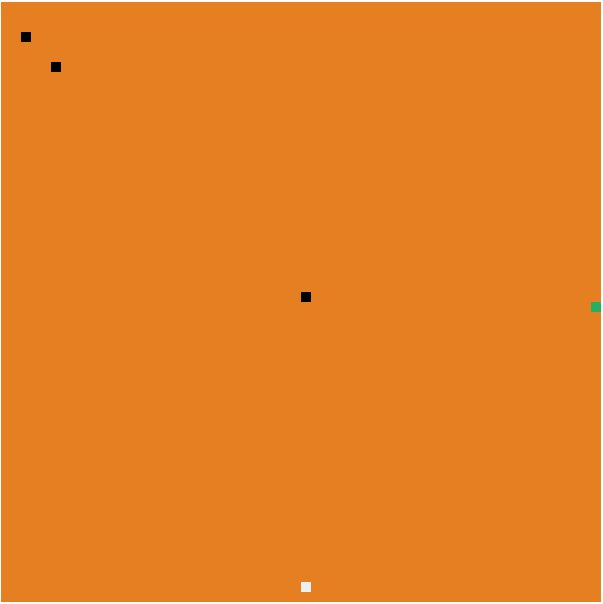

# Find Your Way Out

A simple game I made in order to try out game-shell created by @mikolalysenko. This project is also my first try at using browserify. So, lets rock n roll.

The purpose of this game is to get the white box to the green box. Easy Game.

**This game is still in progress**

## What If?

What if, in order to set the configuration of each level, I just need to write this:

    {
      world: {
        width: 600,
        height: 600,
        actor: {
          width: 10,
          height: 10,
          color: "#ECF0F1"
        },
        out: {
          width: 10,
          height: 10,
          color: "#27AE60"
        },
        blocks: {
          width: 10,
          height: 10,
          color: "#000000"
        }
      },
      levels: [
        {
          blocks: [
          {x: 300, y: 290},
          {x: 50, y: 60},
          {x: 20, y: 30}
          ],
          actor: {
            x: 300,
            y: 580,
          },
          out: {
            x: 590,
            y: 300
          }
        },
        {
          blocks: [
          {x: 10, y: 50},
          {x: 20, y: 500},
          {x: 300, y: 400},
          {x: 490, y: 110}
          ],
          actor: {
            x: 300,
            y: 500
          },
          out: {
            x: 590,
            y: 300
          }
        }
      ]
    }

## TODO

1. Make it more challenging? :p
2. Level Editor :D
3. Use countdown
4. Make it more pretty?

## License
Copyright (c) 2013 A. Akbar Hidayat
Licensed under the MIT license.
